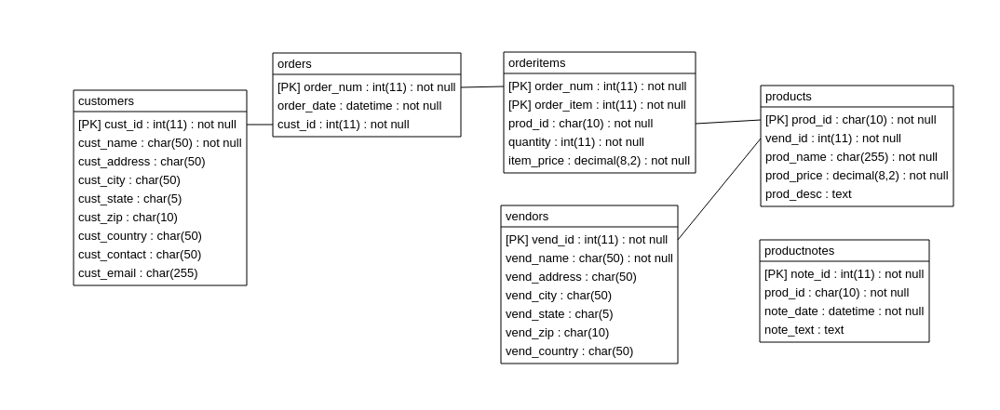

MySQL Crash Cource
===========================

* 第1章 [了解SQL](script/01-understanding-sql.sql)
* 第2章 [MySQL简介](script/02-introducing-mysql.sql)
* 第3章 [使用MySQL](script/03-working-with-mysql.sql)
* 第4章 [检索数据](script/04-retrieving-data.sql)
* 第5章 [排序检索数据](script/05-sorting-retrieved-data.sql)
* 第6章 [过滤数据](script/06-filtering-data.sql)
* 第7章 [数据过滤](script/07-advanced-data-filtering.sql)
* 第8章 [用通配符进行过滤](script/08-using-wildcard-filtering.sql)
* 第9章 [用正则表达式进行搜索](script/09-searching-using-regular-expressions.sql)
* 第10章 [创建计算字段](script/10-creating-calculated-fields.sql)
* 第11章 [使用数据处理函数](script/11-using-data-manipulation-functions.sql)
* 第12章 [汇总数据](script/12-summarizing-data.sql)
* 第13章 [分组数据](script/13-grouping-data.sql)
* 第14章 [使用子查询](script/14-working-with-subqueries.sql)
* 第15章 [联结表](script/15-joining-tables.sql)
* 第16章 [创建高级联结](script/16-creating-advanced-joins.sql)
* 第17章 [组合查询](script/17-combining-queries.sql)
* 第18章 [全文本搜索](script/18-full-text-searching.sql)
* 第19章 [插入数据](script/19-inserting-data.sql)
* 第20章 [更新和删除数据](script/20-updating-and-deleting-data.sql)
* 第21章 [创建和操纵表](script/21-creating-and-manipulating-tables.sql)
* 第22章 [使用视图](script/22-using-views.sql)
* 第23章 [使用存储过程](script/23-working-with-stored-procedures.sql)
* 第24章 [使用游标](script/24-using-cursors.sql)
* 第25章 [使用触发器](script/25-using-triggers.sql)
* 第26章 [管理事务处理](script/26-managing-transaction-processing.sql)
* 第27章 [全球化和本地化](script/27-globalization-and-localization.sql)
* 第28章 [安全管理](script/28-managing-security.sql)
* 第29章 [数据库维护](script/29-database-maintenance.sql)
* 第30章 [改善性能](script/30-improving-performance.sql)

数据库ER图
===========================

